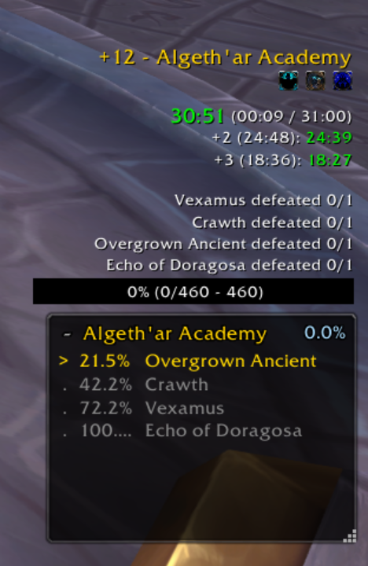

  

# MDT Checkpoints

A Mythic+ overlay that shows boss % gates from your [Mythic Dungeon Tools](https://www.curseforge.com/wow/addons/mythic-dungeon-tools) route, with live progress tracking as you kill enemies.

## Features

- Reads boss gate % thresholds directly from your active MDT route
- Tracks live forces % via `C_Scenario` and highlights the upcoming gate
- Warns (orange `>>`) when you're within 8% of the next gate
- Collapses to show only the next gate — right-click or use the `+/-` button
- Draggable, resizable, and lockable
- Settings panel accessible via `/mdtcp config` or the WoW Settings menu

## Requirements

- [Mythic Dungeon Tools](https://www.curseforge.com/wow/addons/mythic-dungeon-tools) (required)

## Installation

1. Download and extract the `MDTCheckpoints` folder
2. Place it in `World of Warcraft/_retail_/Interface/AddOns/`
3. Enable it in the WoW addon list

## Screenshot

  

## Slash Commands

| Command | Description |
|---|---|
| `/mdtcp config` | Open settings panel |
| `/mdtcp reload` | Re-read route from MDT |
